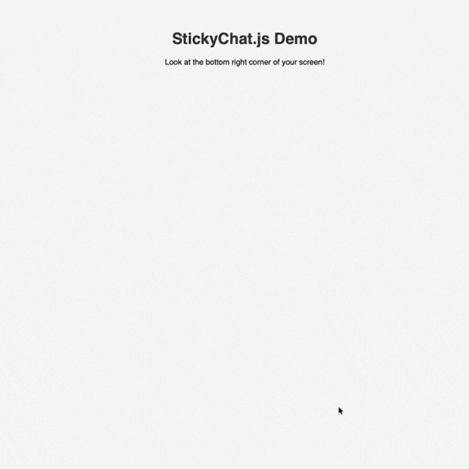

# StickyChat.js 💬


An elegant, responsive, flexible, and lightweight jQuery plugin that adds a sticky WhatsApp floating chat button to your website.

Built with modern CSS (Flexbox, CSS Variables, Backdrop Filters) and zero image dependencies (pure SVG).

---

## 🌟 Demo


---

## ✨ Features

- **Extremely Lightweight:** Under 2KB zipped
- **Modern Design:** Uses glassmorphism (backdrop-filter) for the tooltip
- **Responsive:** Adapts automatically to mobile screens
- **Accessible:** Includes ARIA labels and `noopener noreferrer` tags for secure external links
- **Customizable:** Easily change colors, messages, and positioning via JS or CSS variables

---

## 🚀 Installation

1. Download the `jquery.stickychat.css` and `jquery.stickychat.js` files from the `stickychat-plugin` folder.
2. Include them in your HTML file, making sure jQuery is loaded first.

```html
<link rel="stylesheet" href="stickychat-plugin/jquery.stickychat.css">
<script src="https://code.jquery.com/jquery-3.7.1.min.js"></script>
<script src="stickychat-plugin/jquery.stickychat.js"></script>
```

---

## 🛠️ Usage

Initialize StickyChat on your page (after the DOM is ready):

```js
$(document).ready(function() {
    $('body').stickyChat({
        phoneNumber: "1234567890", // Your country code + number (no + sign)
        message: "Need help? Chat with us!",
        position: "right", // or "left"
        backgroundColor: "#25D366", // Optional: button color
        defaultText: "Hi! I found your website and need some assistance."
    });
});
```

---

## ⚙️ Configuration Options

| Option           | Type   | Default Value                        | Description                                              |
|------------------|--------|--------------------------------------|----------------------------------------------------------|
| phoneNumber      | String | "1234567890"                        | WhatsApp number (country code + number, no + sign)       |
| message          | String | "Chat with us on WhatsApp!"         | Text inside the hover bubble                             |
| position         | String | "right"                             | "left" or "right" side of the screen                    |
| backgroundColor  | String | "#25D366"                           | Button background color                                  |
| defaultText      | String | "Hello! I have a question about..." | Pre-filled WhatsApp message                              |

---

## 🤝 Contributing

1. Fork the project
2. Create your feature branch (`git checkout -b feature/AmazingFeature`)
3. Commit your changes (`git commit -m 'Add some AmazingFeature'`)
4. Push to the branch (`git push origin feature/AmazingFeature`)
5. Open a Pull Request

This project is licensed under the MIT License. Feel free to use it in personal and commercial projects.
